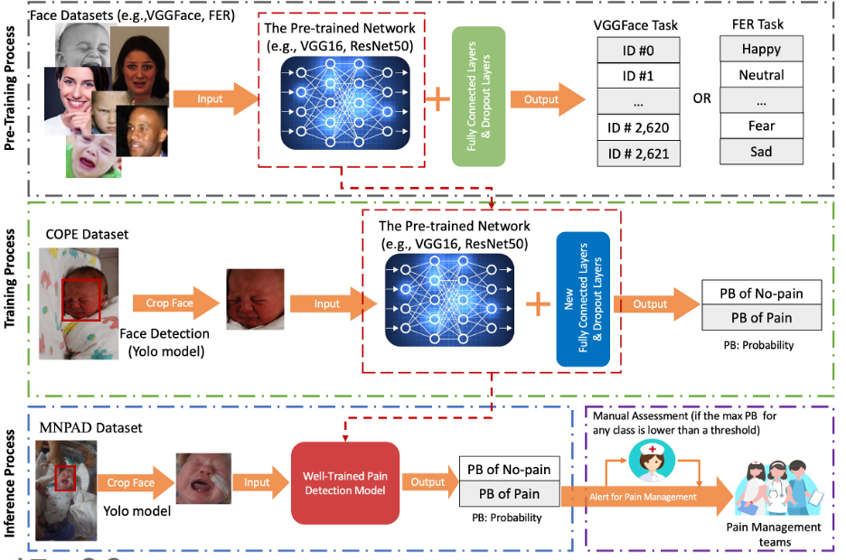

# NeoPainAI

**[Healthcare AI]** A computer vision pipeline for face detection, neonatal pain assessment, and human-in-the-loop clinical decision support.

Neonatal pain is often under-detected in clinical settings. This project proposes an end-to-end deep learning framework that localizes infant faces, estimates pain/no-pain probability from facial expressions, and routes low-confidence predictions to clinicians for manual review—combining automated screening with safe clinical oversight.

---

## Overall Structure

The proposed workflow consists of three stages: **pre-training**, **fine-tuning on neonatal data**, and **clinical inference with human-in-the-loop fallback**.

<p align="center">
  
</p>

| Stage | Input | Core Models | Output |
|-------|-------|-------------|--------|
| **1. Pre-Training** | VGGFace, FER | VGG16 / ResNet50 + FC & Dropout layers | Identity & expression representations |
| **2. Training** | COPE (neonatal faces) | YOLO face detection → transfer learning → pain classifier | PB of No-pain / PB of Pain |
| **3. Inference** | MNPAD (clinical data) | YOLO + fine-tuned pain model + confidence gate | Automated prediction or alert for manual assessment |

### Stage 1 — Pre-Training

General face datasets (**VGGFace**, **FER**) are used to pre-train a backbone network (VGG16 or ResNet50) with fully connected and dropout layers. The model learns rich facial representations through:

- **VGGFace task:** identity classification (2,621 subjects)
- **FER task:** expression classification (e.g., Happy, Neutral, Fear, Sad)

These learned features serve as a strong initialization for downstream neonatal pain assessment, reducing dependence on limited clinical data.

### Stage 2 — Training (Transfer Learning)

On the **COPE** neonatal dataset:

1. **Face detection** — A YOLO model detects and crops the infant face from each image.
2. **Transfer learning** — The pre-trained backbone is loaded and the original output layers are replaced with new FC & dropout layers for binary pain classification.
3. **Fine-tuning** — The model is trained to output class probabilities: **PB of No-pain** and **PB of Pain**.

Data augmentation (rotation, horizontal flip) and early stopping are applied during training to improve generalization.

### Stage 3 — Inference & Human-in-the-Loop Decision Support

At deployment on the **MNPAD** dataset (or new clinical data):

1. YOLO detects and crops the neonatal face.
2. The fine-tuned pain detection model outputs pain/no-pain probabilities.
3. **Confidence-based routing:**
   - If `max(PB) ≥ threshold` → the model prediction is accepted automatically.
   - If `max(PB) < threshold` → an **alert for pain management** is raised and the case is sent to a clinician for manual assessment before any clinical action.

This human-in-the-loop design ensures that uncertain predictions are not acted upon without expert review.

---

## Repository Structure

```
NeoPainAI/
├── data/
│   └── over_all_pic.png          # Pipeline overview diagram
├── env/
│   └── env.yml                   # Conda environment specification
├── model/
│   ├── face_detect/              # YOLO-based neonatal face detection
│   │   ├── yolo.py
│   │   ├── yolo_video_for_image_pain.py
│   │   └── train.py
│   └── pain_detect/              # Transfer-learning pain classifier
│       ├── model.ipynb           # Training & inference notebook
│       └── models/
│           └── custom_model.py   # ResNet50-based classifier
└── utils/
    ├── extract_key_frame.ipynb   # Key-frame extraction from video
    └── extract_clip.ipynb        # Video clip extraction
```

---

## Installation

Requires [Conda](https://docs.conda.io/en/latest/) and a CUDA-capable GPU (TensorFlow 1.7 + CUDA 9.0).

```bash
git clone https://github.com/<your-org>/NeoPainAI.git
cd NeoPainAI
conda env create -f env/env.yml
conda activate yoloclone
```

Download pre-trained weights and place them under `data/weights/` (see [Model Weights](#model-weights) below).

---

## Usage

### 1. Face Detection (YOLO)

```bash
cd model/face_detect
python yolo_video_for_image_pain.py
```

Detects and crops infant faces from input images; outputs are saved to the configured face directory.

### 2. Pain Classification

Open and run `model/pain_detect/model.ipynb`:

- **Training:** fine-tune the ResNet50-based model on COPE face crops with data augmentation.
- **Inference:** load weights from `data/weights/model_weight.hdf5`, run predictions on MNPAD test data, and apply the confidence threshold (`k = 0.55` by default) to route uncertain cases to the manual branch.

### 3. Data Preprocessing (optional)

Use the notebooks in `utils/` to extract key frames or clips from raw neonatal video recordings before face detection.

---

## Datasets

| Dataset | Role | Access |
|---------|------|--------|
| [VGGFace](http://www.robots.ox.ac.uk/~vgg/data/vgg_face/) | Pre-training (identity) | Public |
| [FER](https://www.kaggle.com/datasets/msambare/fer2013) | Pre-training (expression) | Public |
| [COPE](https://link.springer.com/chapter/10.1007/978-3-540-47527-9_9) | Training (neonatal pain) | Request from authors |
| [USF-MNPAD-I](https://www.sciencedirect.com/science/article/pii/S2352340921000809) | Inference / evaluation | Request from authors |

> Dataset access for COPE and MNPAD requires direct contact with the respective study teams.

---

## Model Weights

Pre-trained model weights are available at:

**[Download weights (Box)](https://uab.box.com/s/qtmygwcxhxz3kjl8f9s440fmyv8gtp9g)**

Place downloaded files in `data/weights/`.

---

## Technologies

- **Deep Learning:** TensorFlow 1.7, Keras 2.2, Keras-VGGFace
- **Face Detection:** YOLOv3 (Darknet)
- **Backbone:** ResNet50 (ImageNet pre-trained, fine-tuned)
- **Environment:** Python 3.6, Conda

---

## Acknowledgements

This work builds on the [COPE](https://link.springer.com/chapter/10.1007/978-3-540-47527-9_9) and [USF-MNPAD-I](https://www.sciencedirect.com/science/article/pii/S2352340921000809) datasets. We thank the researchers and participants of both studies for enabling research on automated neonatal pain assessment.

---

## Disclaimer

This software is intended for **research purposes only**. It is not a medical device and must not be used as the sole basis for clinical decisions. Always consult qualified healthcare professionals for patient care.
